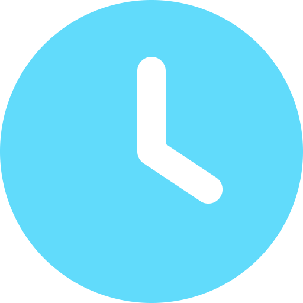

<a name="readme-top"></a>

[![Contributors][contributors-shield]][contributors-url]
[![Forks][forks-shield]][forks-url]
[![Stargazers][stars-shield]][stars-url]
[![Issues][issues-shield]][issues-url]
[![MIT License][license-shield]][license-url]
[![LinkedIn][linkedin-shield]][linkedin-url]

<br />
<div align="center">
  <div>
  <a href="https://github.com/devrafaelsoares/react-countdown">

   
 </a>

  </div>

  <h3 align="center">react-countdown</h3>

  <p align="center">
    <br />
    <a href="https://github.com/devrafaelsoares/react-countdown"><strong>Explore a documentação »</strong></a>
    <br />
    <br />
    <a href="https://github.com/devrafaelsoares/react-countdown">Visualizar a demonstração</a>
    ·
    <a href="https://github.com/devrafaelsoares/react-countdown/issues">Reportar Bug</a>
    ·
    <a href="https://github.com/devrafaelsoares/react-countdown/issues">Request Feature</a>
  </p>
</div>

<details>
  <summary>Índice</summary>
  <ol>
    <li>
      <a href="#sobre-o-projeto">Sobre o projeto</a>
      <ul>
        <li><a href="#construído-com">Construído com</a></li>
      </ul>
    </li>
    <li>
      <a href="#começando">Começando</a>
      <ul>
        <li><a href="#pré-requisitos">Pré-requisitos</a></li>
        <li><a href="#instalação">Instalação</a></li>
      </ul>
    </li>
    <li><a href="#contatos">Contatos</a></li>
  </ol>
</details>

## Sobre o projeto

<div>
  <div style="display: flex; justify-content: center; flex-direction: column; align-items: center; gap: 1em; padding: 1em 0">
    <div align="center">
      
      &nbsp;&nbsp;&nbsp;&nbsp;&nbsp;&nbsp;&nbsp;&nbsp;&nbsp;&nbsp;&nbsp;&nbsp;&nbsp;
      
  </div>
  <p>
  Este projeto foi elaborado com o objetivo de difundir meus conhecimentos e estudos em relação à biblioteca React. React opera por meio da componentização de elementos e renderizações, possibilitando a criação de modelos interativos, ágeis e expansíveis. Além disso, a integração do TypeScript oferece maior controle, prevenção de erros e garante uma abordagem mais robusta e segura no tratamento dos dados, graças à tipagem estática forte, permitindo a detecção e correção de erros durante o processo de desenvolvimento.
  </p>
</div>
  <p align="right"><a href="#readme-top">🔝| Voltar para o topo</a></p>

### Construído com:

![React][react-badge]
![Typescript][typescript-badge]
![NodeJS][node-js-badge]
![TailwindCSS][tailwindcss]

<p align="righ"><a href="#readme-top">🔝| Voltar para o topo</a></p>

## Começando

### Pré-requisitos

Será necessário atualizar o Node Packager Manager (NPM)

-   ```sh
    npm install npm@latest -g
    ```

### Instalação

1. Clone o repositório
    ```sh
    git clone https://github.com/devrafaelsoares/react-countdown.git
    ```
2. Instale os pacotes do node
    ```sh
    npm install
    ```
3. Execute a aplicação

    ```js
    npm run dev
    ```

4. Acesse em seu navegador
    ```sh
    http://localhost:5173
    ```

<p align="righ"><a href="#readme-top">🔝| Voltar para o topo</a></p>

## Contatos

🔰 | Projeto: [https://github.com/devrafaelsoares/react-countdown](https://github.com/devrafaelsoares/react-countdown)

✉️ | E-mail: [rafael.soares.developer@gmail.com](mailto:rafael.soares.developer@gmail.com)

🧑🏾‍💻 | Portfólio: [https://devrafaelsoares.vercel.app](https://devrafaelsoares.vercel.app)

<p align="righ"><a href="#readme-top">🔝| Voltar para o topo</a></p>

[contributors-shield]: https://img.shields.io/github/contributors/devrafaelsoares/react-countdown.svg?style=for-the-badge
[contributors-url]: https://github.com/devrafaelsoares/react-countdown/graphs/contributors
[forks-shield]: https://img.shields.io/github/forks/devrafaelsoares/react-countdown.svg?style=for-the-badge
[forks-url]: https://github.com/devrafaelsoares/react-countdown/network/members
[stars-shield]: https://img.shields.io/github/stars/devrafaelsoares/react-countdown.svg?style=for-the-badge
[stars-url]: https://github.com/devrafaelsoares/react-countdown/stargazers
[issues-shield]: https://img.shields.io/github/issues/devrafaelsoares/react-countdown.svg?style=for-the-badge
[issues-url]: https://github.com/devrafaelsoares/react-countdown/issues
[license-shield]: https://img.shields.io/github/license/devrafaelsoares/react-countdown.svg?style=for-the-badge
[license-url]: https://github.com/devrafaelsoares/react-countdown/blob/master/LICENSE
[linkedin-shield]: https://img.shields.io/badge/-LinkedIn-black.svg?style=for-the-badge&logo=linkedin&colorB=555
[linkedin-url]: https://www.linkedin.com/in/rafael-henrique-soares-de-freitas-2a667a23a/
[typescript-badge]: https://img.shields.io/badge/-Typescript-333333?style=flat&logo=typescript
[react-badge]: https://img.shields.io/badge/-React-333333?style=flat&logo=react
[node-js-badge]: https://img.shields.io/badge/-NodeJS-333333?style=flat&logo=node.js
[tailwindcss]: https://img.shields.io/badge/-TailwindCSS-333333?style=flat&logo=tailwindcss
